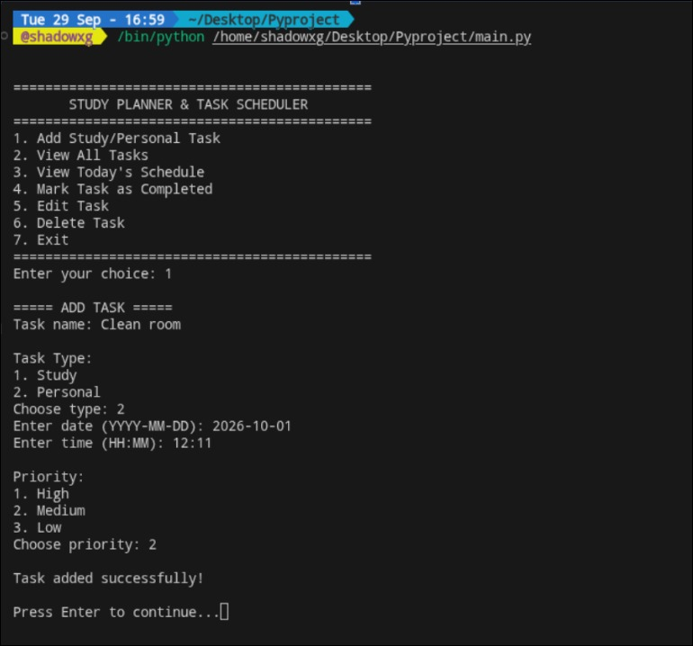
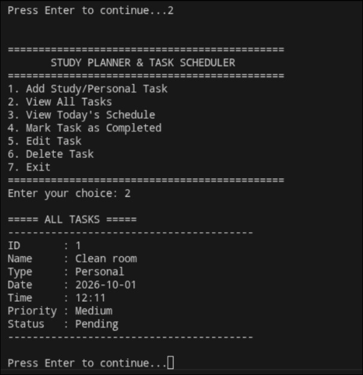
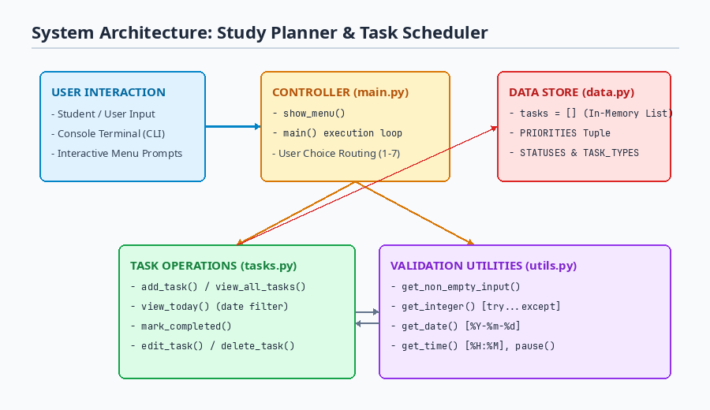

# Study Planner & Task Scheduler

A simple command-line Python application to help students organize daily academic assignments, study sessions, and personal tasks in one place.

---

## Overview

When entering college as a first-year student, managing multiple subject deadlines, lab submissions, and daily study routines quickly gets overwhelming. Most existing to-do apps either require sign-ups, internet access, or have too many confusing options. 

I created this **Study Planner & Task Scheduler** as my course project to solve this problem. It is a lightweight, offline, menu-driven Python program that runs directly in the terminal. It lets students record tasks with specific dates, times, categories (Study vs Personal), and priority levels, and view what needs to be done on any given day.

---

## Features

- **Categorized Task Entry**: Separate tasks into *Study* (assignments, exam prep) and *Personal* (chores, club activities).
- **Date & Time Scheduling**: Store tasks with structured dates (`YYYY-MM-DD`) and 24-hour time slots (`HH:MM`).
- **Priority Management**: Assign priorities as High, Medium, or Low to identify what needs immediate attention.
- **Daily Schedule Filter**: Filter and view tasks scheduled for a specific date instead of browsing the entire list.
- **Status Tracking**: Keep track of whether a task is "Pending" or "Completed".
- **Edit & Delete Options**: Update task details or remove tasks when plans change.
- **Crash-Proof Input Validation**: Custom input checking prevents the program from crashing if a user enters incorrect dates, letters instead of numbers, or blank names.

---

## Project Structure

The project is split into four modular files to keep the code clean and easy to maintain:

```text
Pyproject/
│
├── main.py       # Main menu loop and user interaction entry point
├── tasks.py      # Core task logic (add, view, filter, edit, delete, mark complete)
├── data.py       # In-memory data store and constant tuples for options
├── utils.py      # Reusable input validation functions (date, time, numbers)
├── README.md     # Project documentation and setup guide
└── statement.md  # Formal problem statement and scope definition
```

---

## Technologies Used

- **Language**: Python 3 (3.8+)
- **Standard Libraries**:
  - `datetime` — for parsing and validating dates and times.
- **External Dependencies**: None (runs purely on standard Python without extra package installation).

---

## How to Install and Run

### 1. Prerequisites
Make sure Python 3 is installed on your computer. You can check by running:
```bash
python3 --version
```
*(On Windows, you may use `python --version`)*

### 2. Download / Clone the Repository
Download the project files or clone the repository to your local machine:
```bash
git clone https://github.com/your-username/study-planner.git
cd study-planner
```

### 3. Run the Program
Start the program directly using Python:
```bash
python3 main.py
```

---

## How to Use the Application

Once launched, you will see the main menu:

```text
=============================================
       STUDY PLANNER & TASK SCHEDULER
=============================================
1. Add Study/Personal Task
2. View All Tasks
3. View Today's Schedule
4. Mark Task as Completed
5. Edit Task
6. Delete Task
7. Exit
=============================================
Enter your choice:
```

### Example Walkthrough:
1. **Adding a Task**: Press `1`. Enter the title (e.g., `Calculus Assignment 2`), choose type `1` (Study), enter the deadline date (`2026-10-05`), time (`18:00`), and choose priority `1` (High).
2. **Checking Today's Tasks**: Press `3`. Enter today's date (`2026-10-05`). It will list only tasks due on that day.
3. **Completing a Task**: Press `4`. Enter the ID of the task you finished. Its status changes to `Completed`.
4. **Editing or Deleting**: Press `5` to change task name or priority, or `6` to remove a task by its ID.

---

## Testing & Sample Test Cases

Here are manual test cases you can try to verify the application:

| Test Case | Steps / Input | Expected Result |
| :--- | :--- | :--- |
| **TC-01: Empty Input Check** | Choose `1`, leave task name empty and press Enter. | Displays `"Input cannot be empty."` and prompts again. |
| **TC-02: Date Validation** | Enter date as `25-12-2026` or `today`. | Displays `"Invalid date format."` and asks for `YYYY-MM-DD`. |
| **TC-03: Time Validation** | Enter time as `25:00` or `7pm`. | Displays `"Invalid time format."` and asks for `HH:MM`. |
| **TC-04: Non-Integer ID** | Choose `4` (Mark Complete) and enter `abc`. | Displays `"Please enter a valid number."` without crashing. |
| **TC-05: Task Lifecycle** | Add task -> View tasks -> Mark completed -> Delete. | Task is added with ID 1, status updates to Completed, then gets deleted. |

---

## Sample Program Output

```text
=============================================
       STUDY PLANNER & TASK SCHEDULER
=============================================
1. Add Study/Personal Task
2. View All Tasks
3. View Today's Schedule
4. Mark Task as Completed
5. Edit Task
6. Delete Task
7. Exit
=============================================
Enter your choice: 2

===== ALL TASKS =====
----------------------------------------
ID       : 1
Name     : Physics Lab Record Submission
Type     : Study
Date     : 2026-09-30
Time     : 14:00
Priority : High
Status   : Pending
----------------------------------------
ID       : 2
Name     : Buy Notebooks from Bookstore
Type     : Personal
Date     : 2026-09-30
Time     : 17:30
Priority : Low
Status   : Completed
----------------------------------------
```

---

## Screenshots

### 1. Main Menu Screen


### 2. Adding a Task with Categories and Priorities


### 3. Viewing Stored Tasks


### 4. System Architecture Diagram



---

## Future Improvements

- Save tasks to a JSON file or SQLite database so data persists when the program closes.
- Add sound/notification alerts when a deadline is approaching.
- Build a graphical user interface (GUI) using Tkinter or PyQt.

---

## Author

- **Name**: Mangal Nath Yadav (First Year B.Tech CSE)